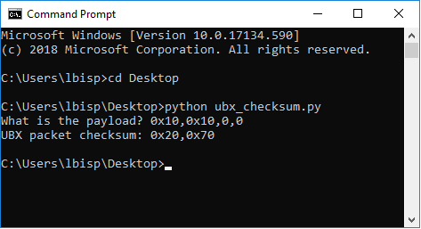

# u-blox-UBX-checksum
u-blox UBX checksum

Forked from [tomazas/ubx_checksum.py](https://gist.github.com/tomazas/3ab51f91cdc418f5704d)

1. Save the file to your computer 
2. Open the terminal cmd
3. Change the directory
4. And run using python:

